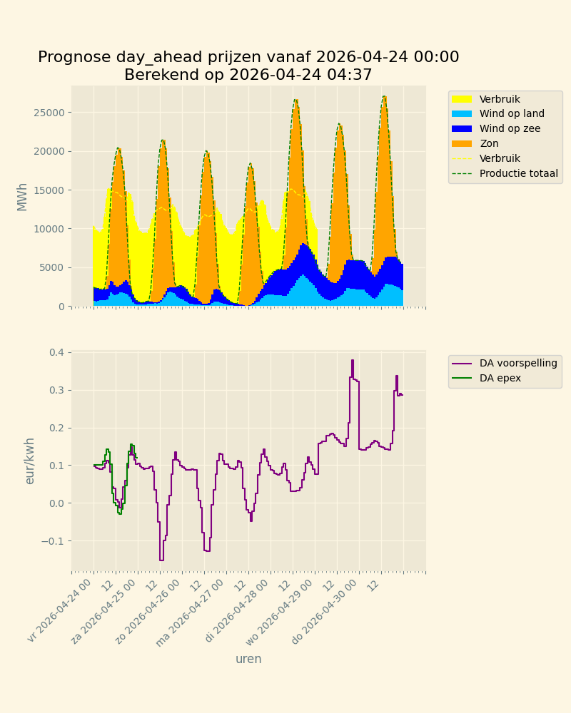

# DAY AHEAD PREDICTOR

DAP is een programma dat voorspelt hoe de Day Ahead prijzen in Nederland zich ontwikkelen tot maximaal 7 dagen vooruit.

Het programma maakt gebruik van een ml-techniek: xgboosting (zie https://xgboost.readthedocs.io/)

Daartoe zijn en worden over een periode van een jaar de volgende uurgegevens verzameld (met bronvermelding):
- de totale energiecomsumptie van de Nederlandse maatschappij (ned.nl)
- de elektriciteistproductie door windmolens op zee (ned.nl)
- de elektriciteitsproductie door windwmolen op land (ned.nl)
- de elektriciteitsproductie door zonnepanelen(ned.nl)
- de elektriciteitsproductie met fossiele bronnen (berekend met de formule
 fossiele productie = consumptie - zon - wind
- de day-ahead elektriciteitsprijzen (Nordpool)
Deze gegevens worden aangevuld met andere kwantificeerbare invloeden (dag van de week, uur van de dag, maand, weeknr end)

Met behulp van deze gegevens wordt een ml-model getraind dat in staat is
voor ieder uur de day-ahead prijs te berekenen waarbij voor alle uren de berekende prijs zo goed mogelijk overeenkomt met de werkelijke prijs.
De gegevens van Ned.nl worden om de 6 uur aangevuld cq gecorrigeerd.

Het uiteindelijk model geeft aan wat de invloed is van iedere parameter op berekeningsresultaat. 
   1. fossile: 0.617
   2. season: 0.069
   3. prod_zon: 0.045
   4. quarter: 0.045
   5. cons: 0.042
   6. hour: 0.041
   7. day_of_week: 0.033
   8. week_nr: 0.031
   9. month: 0.030
  10. prod_zeewind: 0.025
  11. prod_wind: 0.022

R² is een maat voor de kwaliteit van het berekende model.
R²= 0.9139

Als we nu van diezelfde parameters ook een verwachting hebben van hun waarde voor de komende dagen dan kunnen we het model gebruiken om een schatting te berekenen (voorspellen) van de uurlijkse Day Ahead prijzen voor elektriciteit.
Ned.nl publiceert voorspellingen van alle genoemdeconsumptie en productiehoeveelheden.
Met behulp van die gegevens kan dan m.b.v. het berekende model een voorspelling worden berekend van de Day Ahead prijzen:

Dit programma maakt dankbaar gebruik van de data van [Ned.nl](https://ned.nl/nl/)